# Generation Knit 

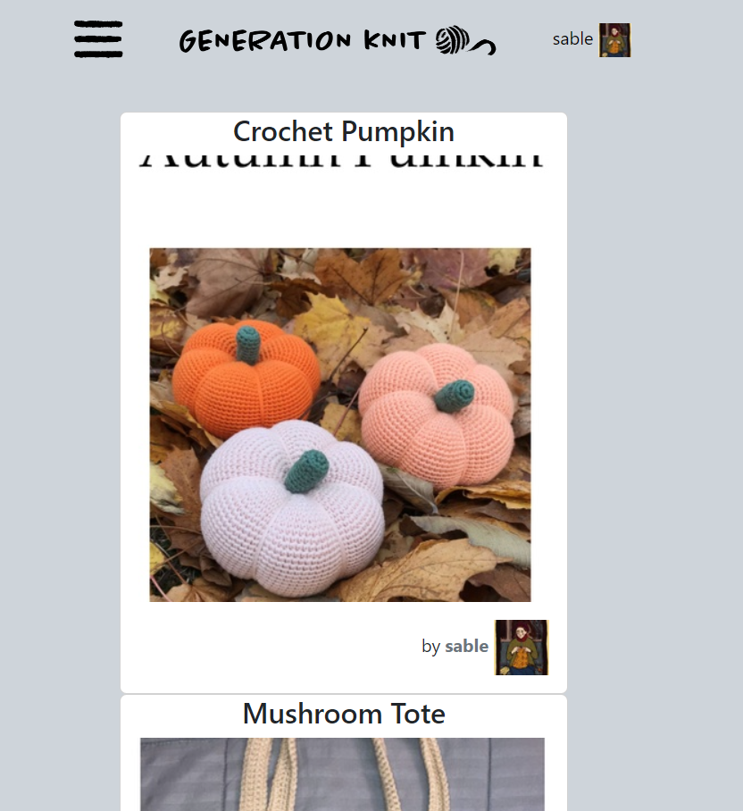

## Overview

Generation Knit is a pattern charing website, built to address the need for a modern, responsive and accesbile website in the online knitting space. It provides a space for users to upload and share pattterns for knitting and crochet 

[Screenshot of Generation Knit home page]

## Project Goals 

For my fourth portfolio projects, I wanted to create a project that both showcased my proficiency with databases, Bootstrap and Django. My project goal is to show that I can use these tools effectively in a creative way.

Generation Knit serves as a platform to both share and find knitting patterns. The goal was to create a platform that stores the information that comes with a knitting pattern and display it back to the user in an attractive and intuitive. The largest community based knitting website on the internet has long been criticized for its confusing layout and lack of accessibilty for visually impaired users. My website aims to address these issues.

## What happened to Generation Knit 1.0? 

I started work on the first version of this project in October 2023. After multiple issues with Codeanywhere, I was advised by Code Institute to start again from scratch on Gitpod. I quickly rebuilt my project as Generation Knit 2.0. The original project can be viewed [here](https://github.com/carlalennon/portfolio-project-4). I started this current project again in January 2024. 

In my job, I do a lot of overtime. This restart was daunting to me, but by working on the project every day I slowly built up a new project from scratch. 

## UX Design

I wanted a simple home page to let the images speak for themselves. Looking at the images is the most pleasurable part of browsing knitting patterns, it should no be marred by stray information all over the page.

For the feed, I settled with having the absolute bare minimum of information available so the picture stand out on their own. This is in direct opposition to other knitting websites, where the tendency is to have information everywhere cluttering up the page and affecting the enjoyment of the browsing experience. 

I created many wireframes for this project, some just to get the look of the site down, and more practical ones. They are included in the wireframe section below. 

I endevoured to create a site that adhered to UX principles. Information is neatly stored and displayed upon request. The website is laid out in a way that is easy to use. 

I created hand-drawn logo and icons for the nav bar, to create some personality for the site 

## Accessibilty Focus

The largest knitting website on the web often receives criticism for its lack of accessibilty to vision-impaired crafters. This is expecially bad when so many elderly people knit, and can be vision impaired. My site is laid out in a way that colourblind users can still use the site. The icons in the nav bar are designed to be distincy from each other so vision impaired users will not have any problems differentiating them. I have also tried to adhered to accessibility guidelines from W3 Schools to improve the site experience for the visually impaired.

## User Avatar

My site user avatar: 
- Young person looking for a modern knitting site
- Like fibre craft, dislikes cluttered UI of extant sites
- Is challenged in finding and sharing knitting patterns in existing social media platforms
- Wants to upload patterns or share those they've found online

## Site Goals

My site goals are as follows: 

- Provide a modern responsive interface for users
- Provide a place for users to discover new patterns
- Provide a place for users to share new patterns they write 
- Provide a place for user to share patterns they find
- Allow users to search patterns by keyword and category
- Allow users to create and customise a profile to showcase their personality 

## Agile Method

I used the agile method to develop my project. I wrote [user stories](https://github.com/carlalennon/generation-knit-2.0/issues?q=is%3Aopen%20is%3Aissue%20project%3Acarlalennon%2F4) and mapped them to a [kanban board](https://github.com/users/carlalennon/projects/4/views/1). I then broke my user stories into tasks and completed the tasks one by one. I also assigned labels to my issues so I can see what they are better.

### User Stories

For Agile development, user stories are an important part of the process. They allow developers to plan according to the needs of the user. This ensures that important steps for the user's experience aren't overlooked in developement. 

On my kanban board, user stories are marked as Must Have, Could Have, or Beautify. Beautify is for styling that doesn't affect functionality.

My user stories are as follows: 

- Users Story: Registration
- User Story: Homepage/Feed
- User Story: Pattern Detail Page
- User Story: User Profile
- User Story: Search for patterns
- User Story: Navigation Bar
- User Story: Upload a Pattern

This can be viewed in closer detail in the [issues section of this project](https://github.com/carlalennon/generation-knit-2.0/issues).

  

    
 User stories on Kanban board

    
    

## Wireframes

### Early Wireframes to get the "Vibe"

  

    
 Early wireframe for the hamburger menu

    
    

    
  

    
Early wireframe for the home feed

    
    

  

    
 Early wireframe for login page

    
    

  

    
 Wireframe for a pattern generation tool

    
    

### Search Wireframes
  

    
 Large Wireframe

    
    

  

    
 Small Wireframe

    
    

  

    
 Search result preview for large screen

    
    

  

    
 Search result preview for small screen

    
    

    
  ### Profile Wireframes

  

    
 User Profile on large screen

    
    

  

    
 User Profile on small screen

    
    

### Feed Wireframes

  

    
 Large Wireframe

    
    

  

  
 Small Wireframe

    
    

## Data Modelling Relationships

I mapped out the relationships between my data models and used these to build my models. I have added a diagram below.
 
  

  
 ERD diagram

    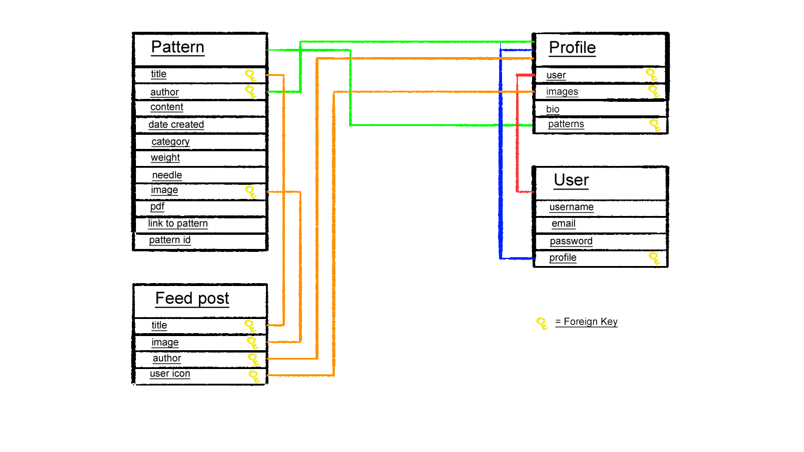
    

## Structure

### Features

#### Home Feed 

Users have access to a home feed that shows all patterns currently uploaded to Generation Knit. This allows for organic discovery of new patterns 

#### Nav Bar

To keep the layout as clean as possible, the site utilises a nav bar that pops in from the side. The bar is decorated with hand drawn icons to give the site some identity.

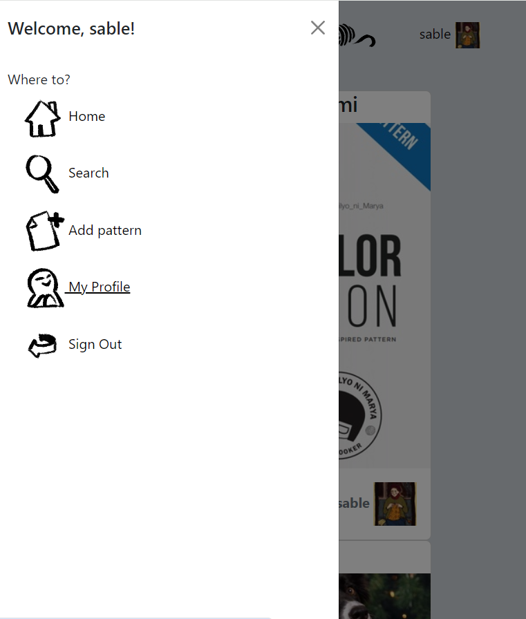 

#### Pattern Detail Page

Each pattern has a detail page where details about the pattern are neatly stored. They are available to access under the collapsing tabs. From this page, the user can also follow a link to the pattern source, or download a link of the pattern'd PDF file.

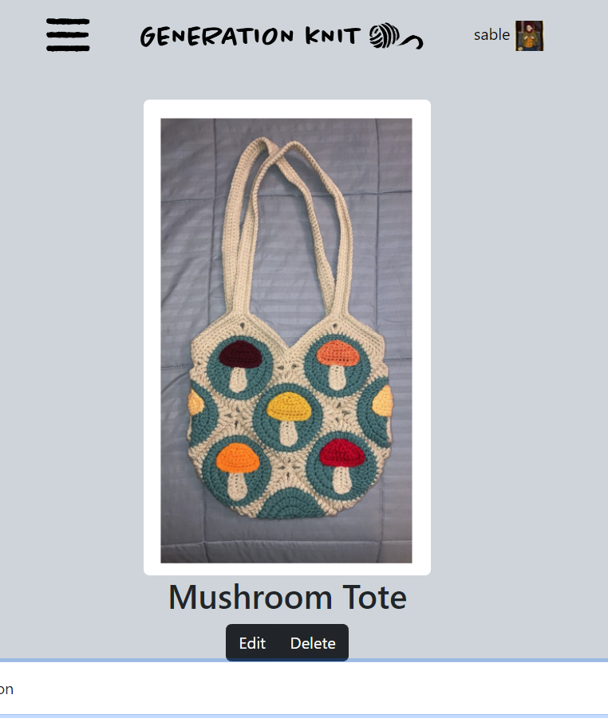

#### Search

Users can search for patterns using either a key word or a filter of the pattern's categorys.

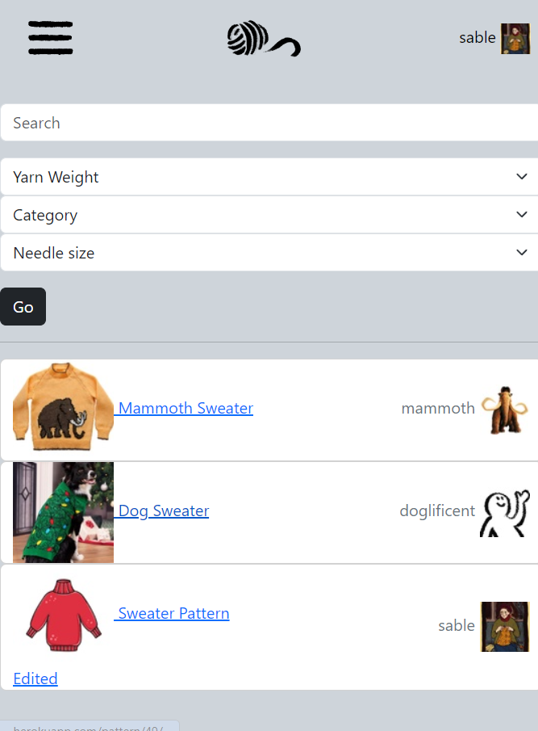

#### Upload a Pattern

If a user has an account, they can upload their pattern to the website to share it with the world. The user has a choice of uploading a PDF directly or linking to a shop page if their pattern is available for sale on another site, such as Etsy or Ravelry.

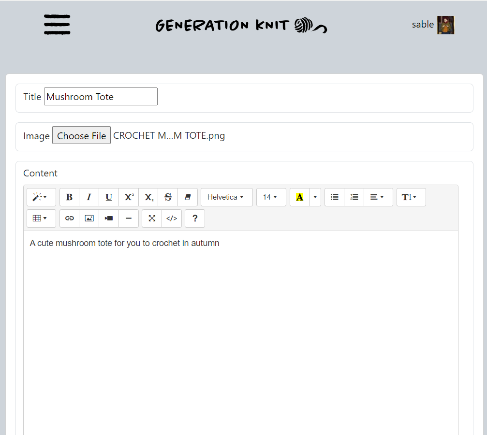

#### Profile

Upon signing up, users are given a profile. They can customise their bio and picture to share something about themselves. The profile page also displays the amount of patterns uploaded by a user. It displays a list of patterns created by the user at the bottom of the page.

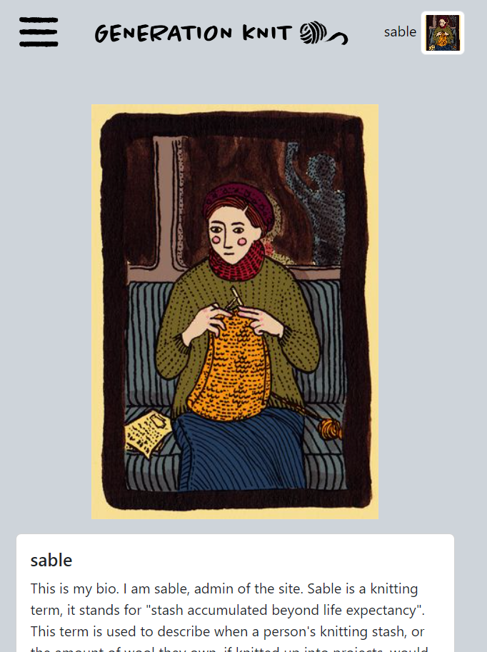

###  Future Features

- Add multiple image uploads to patterns
- Add Cloudinary upload widget to forms for ease of use for user
- Give user the option to change a pdf to an external link or vice versa after pattern is posted
- Allow users to add custom alt text to images they upload
- Add Google Maps integration to allow users to find local yarn store
- Create a Javascript tool that allows users to chart a pattern and download the result as an image
- Add more pattern category options, more needle and yarn sizes

## Design

For Generation Knit, I wanted an extremely streamlined design. The web's major knitting website has information everywhere, nested search bars, and is extremely cluttered and hard for new users to navigate. I wanted the opposite of that. 

It also sports a garish orange colour scheme. For knitting patterns, it can take hours to find the perfect pattern that suits your materials and skill level. The orange also tends to overshadow the beauty of the pieces themselves. I chose a neutral colour palette for a modern look that allows the patterns to pop on the screen.

The other website also has extremely poor mobile compaitibility. I chose to build my site with a mobile-first approach, so that users may enjoy the browsing experience without the hassle of tiny links and images on a smartphone. 

To stop the grey site becoming too stale, I designed a set of hand-drawn assets for the nav bar to bring in an organic look.

  

  
 Menu Icon

    
    

  

  
 Add Pattern Icon

    
    

  

  
 Home Page Icon

    
    

  

  
 My Profile Icon

    
    

  

  
 Search Icon

    
    

  

  
 Sign In Icon

    
    

  

  
 Sign Out Icon

    
    

  

  
 Large Generation Knit Icon

    
    

  

  
 Small Generation Knit Icon

    
    

    
  

  
 New User Automatic Icon

    
    

### Colours 

I chose a colour scheme that is accessible to visually impaired users, and that lets the patterns pop on their own without interference from a bright background colour.

I chose colours with a contrast ratio of 7 or above to keep my site accessible to the visually impaired.

### Typography 

The font used in the Generation Knit logo is "Chantal" from the Adobe Font selection. However, I bypassed loading the extra font into the site by creating the logo and exporting it as a PNG file in Photoshop.

## Languages

### Git 

I used git for version control on this project. Version control allows me to track and control changes to the project. It also allows me to restore older versions of the project should something go wrong. 

I tracked my project using git. I wrote a small descriptive note for each commit to github.

### Django 

I used Django to build my project. Django is a Python framework for developing web apps. Django comes with security features built in to keep sensitive data hidden. It is a popular framework and is widely used in professional development settings. 

I especially liked the tag system, as the tags can accept logical arguments. These can be used to determine whether to show certain HTML or iterate over database entries.

### JavaScript

I used Javascript in combination with Bootstrap to make my website neater and more responsive to the user. A javascript feature of note is the hambuger menu in which the navigation tags are hidden. This allows less visual clutter on the page for the user. It is especially effective for mobile users.

Javascript is not installed in this project, rather it is loaded in using a tag in base.html. The tag is based on the bottom of the page to improve loading times.

### Bootstrap

I used Bootstrap to design the HTML of my website. 

Bootstrap is a front-end development framework available for free on the web. While I am not a Bootstrap expert, I endeavoured to use it to create a pleasant frontend experience and neat HTML.

### CSS 

I used a small amount of custom CSS to style certain aspects of my project. To serve the CSS, each change to custom.css had to be made in VS Code on my PC, saved, uploaded to Cloudinary and refreshed on order to show changes.

### Python 

I used Python to build my views and models. I checked the python was formatted correctly in a Python linter, and adhered to this. The exception is segments where the line length is too long. These are left in as in case this results in broken code.

## Testing and Validation

### Manual Testing 

Manual testing was carried out on User Stories: 

  
 Manual Testing Table 

| User Story                      | Acceptance Criteria                                                                | Action                                                                                                  | Result                                                                                                                                    |      |
|---------------------------------|------------------------------------------------------------------------------------|---------------------------------------------------------------------------------------------------------|-------------------------------------------------------------------------------------------------------------------------------------------|------|
| Upload a Pattern                | Users can upload a pattern when logged in                                          | Upload a pattern to the site when logged in                                                             | I can upload a pattern to Generation Knit                                                                                                 | Pass |
|                                 | The pattern contains at least one image of the garment                             | Look at uploaded pattern and check to see if a garnment picture is uploaded                             | There is a picture attached to the pattern that displays in thumbnails and on the pattern information page                                | Pass |
|                                 | The pattern contains specifications on the pattern eg. yarn weight and needle type | Check "Pattern information" section to check that spec is present                                       | The pattern's spec is present and displays correctly in the table in the "Pattern Information" tab                                        | Pass |
|                                 | The pattern can be found by other users using search                               | Search for this pattern using the search function                                                       | Placing a key word that matches the pattern in the search bar returns a pattern                                                           | Pass |
|                                 | Users can download or travel by hyperlink to the pattern                           | Click on "download PDF" and "Link to pattern" buttons to check they function correctly                  | Both pattern and link buttons lead to their desired pages                                                                                 | Pass |
|                                 | Users can delete a pattern they created                                            | Delete a created pattern and verify it no longer exists                                                 | The pattern is deleted from the database and the user gets a message that says "Your pattern was deleted"                                 | Pass |
| User Story: Search for patterns | Users can access a search bar                                                      | Navigate to the search page using the link in the nav bar                                               | Clicking "Search" in the nav bar loads the search page                                                                                    | Pass |
|                                 | Users can enter a keyword to query                                                 | Enter a keyword into the search bar and press "Go"                                                      | Patterns that match the key word are returned                                                                                             | Pass |
|                                 | A paginated list of results is returned                                            | Enter a query that returns enough results for pagination and check that it's working                    | Fail - there are not enough patterns on Generation Knit at present to test this                                                           | Pass |
|                                 | Results are matched by title or author                                             | Enter an author name and a title name to check for matches                                              | Patterns are returned when a username is typed in and the user has uploaded patterns. Patterns are returned when a title match is entered | Fail |
|                                 | User can filter patterns by criteria                                               | Filter all results by a criteria and press "Go"                                                         | Patterns with a matching criteria to that entered in the dropdowns are returned                                                           | Pass |
| User Story: Pattern Detail Page | Each pattern has it's own pattern page                                             | Click into different patterns and make sure they each have their own page                               | Each pattern has a unique pattern detail page using pattern ID                                                                            | Pass |
|                                 | Pattern page shows image(s) of pattern                                             | Check each pattern has an image                                                                         | Each pattern has it's own unique image                                                                                                    | Pass |
|                                 | Pattern page shows fibre weight and needle size of pattern                         | Check each pattern displays pattern spec                                                                | Each pattern has it's spec displayed in the tab "Pattern Information"                                                                     | Pass |
|                                 | Pattern page provides either a link to pattern or direct PDF download              | Check that buttons are displayed for either a link or PDF for each pattern                              | Each pattern has button(s) available for user to get the pattern                                                                          | Pass |
| User Story: Homepage/Feed       | Feed acts as a home page / index for Gknit                                         | Go to / and make sure the correct HTML is rendered                                                      | / brings the user to the feed page                                                                                                        | Pass |
|                                 | Feed displays patterns uploaded to gknit by users                                  | Check that a list of patterns by gknit users are on home page                                           | The page displays a list of pattern previews by users                                                                                     | Pass |
|                                 | Posts in feed show the project's title, a thumbnail and the pattern author         | Check that each post shows title, pattern thumbnail, and pattern author                                 | Each post displays the title, pattern thumbnail and author, along with user icon                                                          | Pass |
|                                 | Feed updates as new patterns are added                                             | Create a new post and check it's at the top of the feed page                                            | The new post is first in the feed                                                                                                         | Pass |
| User Story: Navigation Bar      | Navigation bar is clearly displayed                                                | Go to all pages on Gknit and ensure navigation bar is displayed                                         | The nav bar is displayed on all pages on gknit                                                                                            | Pass |
|                                 | The links in the bar describe the page they take the user to                       | Click on all navbar links and make sure they go to the correct page                                     | All nav bar links bring the user to the correct page                                                                                      | Pass |
|                                 | The user can access the navigation bar at all times                                | Make sure hamburger menu works on all pages                                                             | The hamburger menu is working on all pages                                                                                                | Pass |
|                                 | The site logo brings the user to home page                                         | Click the logo on small and large screens                                                               | The logo brings the user to the home feed on small and large screens                                                                      | Pass |
|                                 | The navbar displays the login state of the user                                    | Log out and in and check the top right of the nav bar                                                   | The navbar displays the username and icon when logged in and a "Login" button when logged out                                             | Pass |
|                                 | The user icon in the top right brings the user to their profile                    | Click the user icon                                                                                     | The username and icon bring the user to their profile page when logged in                                                                 | Pass |
| User Story: User Profile        | Profile has a profile picture                                                      | Open the user profile and check for a picture                                                           | The profile displays a large version of the user icon                                                                                     | Pass |
|                                 | User can optionally add a short biography                                          | Create an account with no biography, and then add one in                                                | Users are permitted to not have a biography, and can edit the biography after                                                             | Pass |
|                                 | Profile shows the patterns uploaded by the user                                    | Go to a user profile who has patterns, and check they appear                                            | User patterns appear on page                                                                                                              | Pass |
|                                 | Profile shows the amount of patterns uploaded by the user                          | Go to a user profile and check the amount of patterns they have. Users with no patterns should have a 0 | The amount of user patterns is displayed underneath the bio                                                                               | Pass |
|                                 | Users can edit their profile                                                       | Go to a profile while logged in and edit user bio and profile picture                                   | Users can edit their bio and profile picture                                                                                              | Pass |
|                                 | Users can delete their profile                                                     | Go to a profile when logged in and delete the profile                                                   | User profile was deleted                                                                                                                  | Pass |
| User Story: Registration        | Potential users can access a registration form                                     | Go to sign up page                                                                                      | Can access the signup page via login page                                                                                                 | Pass |
|                                 | Users create account with username, email and password                             | Sign up for an account with Gknit                                                                       | Can sign up for an account using username, email and password                                                                             | Pass |
|                                 | Users receive a welcome message upon registration                                  | Check for message upon login                                                                            | User is displayed a "Successful sign in" and "confirmation email" message                                                                 | Pass |
|                                 | Username and email must be unique to the site                                      | Try to sign up with a duplicate email and username                                                      | Cannot sign up with a duplicate username or email                                                                                         | Pass |
|                                 | Passwords are scrambled when stored                                                | Check admin panel to see if passwords are accessible                                                    | Passwords are scrambled in admin panel, they are inaccessbile                                                                             | Pass |
|                                 | User is assigned a temporary user icon on registration                             | Check that new profile has temp icon assigned                                                           | New user has temp icon assigned                                                                                                           | Pass |
|                                 | User is assigned a Profile object on registration                                  | Go to profile page on creation of new user                                                              | There is a new profile page for my new user                                                                                               | Pass |
|                                 | Profile edit and delete buttons only appear on a user's own page                   | Log out and check user profile page                                                                     | Buttons only appear on profile page when user is logged in and it's their own profile                                                     | Pass |
| User Story: Deploy to Heroku    | Configure variables in Heroku to the necessary values for my project               | Add in the appropriate variable in Heroku                                                               | Added in necessary variables                                                                                                              | Pass |
|                                 | Create Procfile and configure settings.py to work with Heroku                      | Create the procfile in the project                                                                      | Created the procfile and configured for launch                                                                                            | Pass |
|                                 | Successfully deploy to Heroku                                                      | Deploy the project to Heroku from branch                                                                | Deployed the project from branch main                                                                                                     | Pass |
|                                 | Test final build before submission                                                 | Check all pages on Heroku build before submission                                                       | Checked all pages on Heroku branch                                                                                                        | Pass |

### Performance Testing

Network testing was done using Chrome devtools. My image loading is very slow, in the future I will look into why this is and how to correct it. I think the issue may be that my images aren't optimised fully.

I upload images using sorl thumbnail's Imagefield, but deliver them with Cloudinary. Before swapping out Sorl Thumbnail for Cloudinary, testing was so slow that Lighthouse could not test my pages and app would not run on Heroku which gives an error after 30 seconds of page loading.

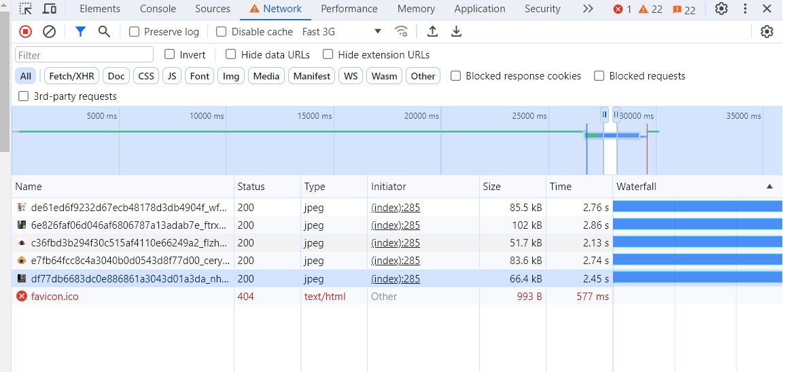

I also did some troubleshooting on slow database queries. While not always slow, they sometimes are causing delays in the site. I had to choose an American server to get an up-to-date verison of PostgreSQL, which may also be contributing to load times. In my research, most sources said that this would likely be solved by upgrading to a paid plan with ElephantSQL. 

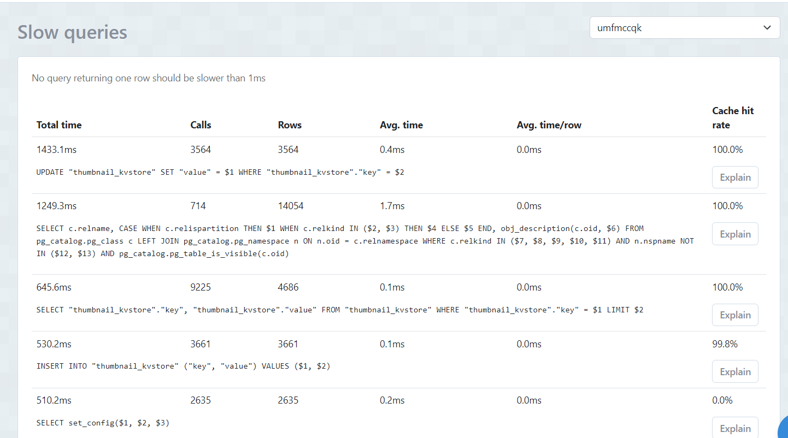

I also tried to use Lighthouse to test what exactly was the issue on the page, but it wouldn't test and only returned this error. 

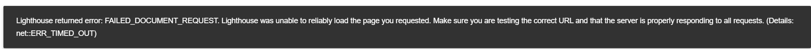

Along with a similar error from PageSpeed Insights. 

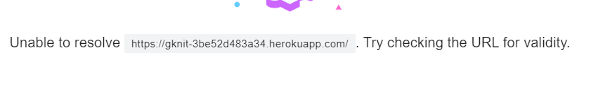

I am using sorl thumbnail for image resizing results are slow. Here's an example of a typical server response:

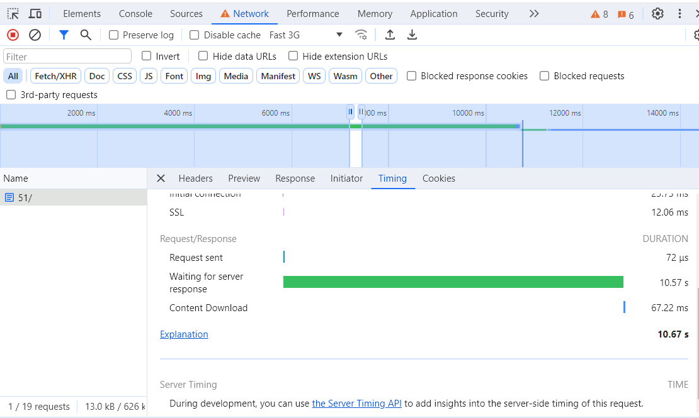

Here are my more successful Lighthouse tests:

  
 Lighthouse test for home page 

    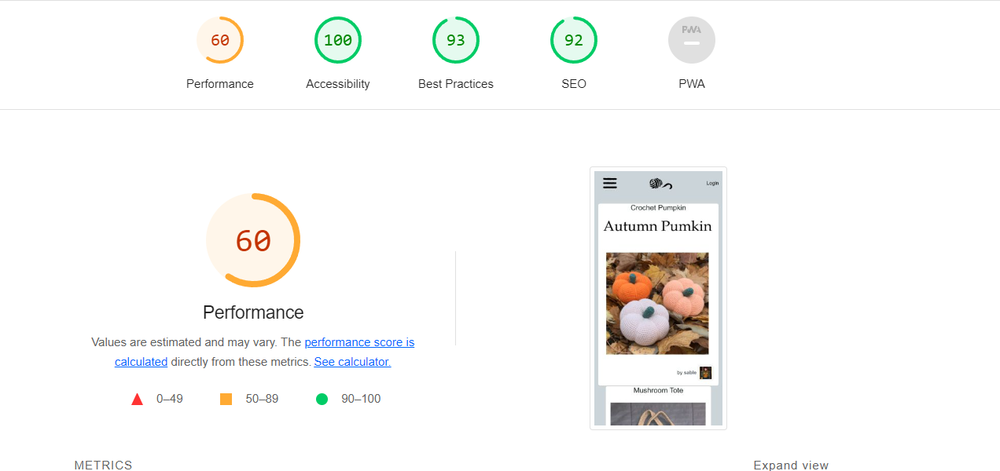
    

  
 Lighthouse test for pattern page 

    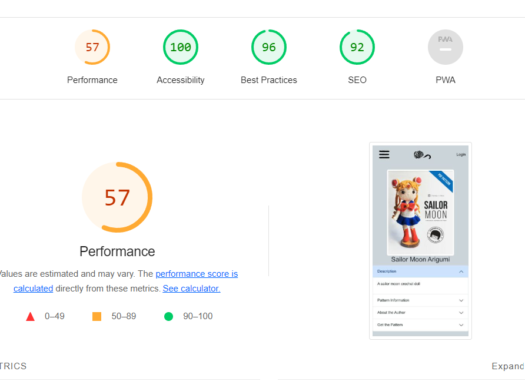
    

  
 Lighthouse test for profile page 

    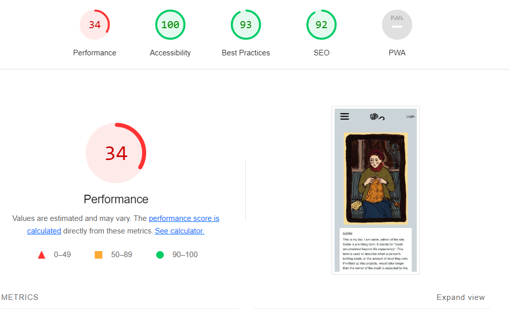
    

  
 Lighthouse test for search page 

    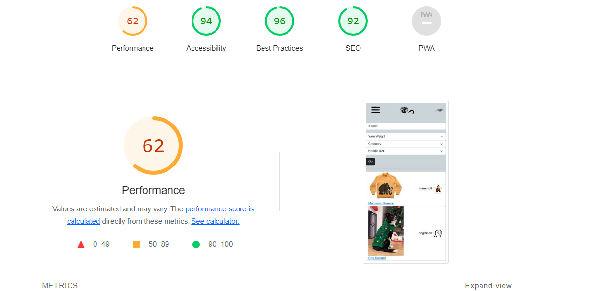
    

The site is still slow, I am not happy with the loading times. In the future, I would run more tests to see why my site is so slow and what I can do to optimise it further.

### Linting 

#### HTML

I used the W3C schools linter to check my html. It does not like Django tags, so my goal was to solve every error it gave apart from the Django related errors. 

The HTML linter really didn't like Django, and showed a lot of errors in all HTML with Django tags

I used "Validate by Direct Input"

I worked through errors in my code until only the Django related errors were left. 

Some common errors:

  
 Button cannot be a child of an "a" tag

    
    

  
 Image tags require an alt attribute (I had been using "name" as an alt )

    
    

  
 Stray tags 

    
    

#### Python

I used an  to paste each python file into to observe the differences. I then manually made changes to each file. I did not want to use an automatica linter to avoid breaking any of my Django

#### CSS

I used  to check my CSS file. It gave me 6 warnings for the !important tag in my CSS. However, I decided to keep these in because the custom CSS would not appear without them. I believe this is because my Bootstrap is served from a CDN. Installing Bootstrap to the static folder in Cloudinary appendsa random string to each file. Even when this is removed, the Bootstrap files are still broken. This prevented me from using SASS customisation.

  
 CSS Lint warnings and no issues

    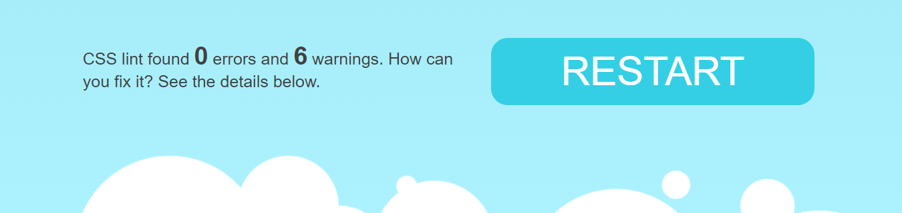
    

### Responsive Design 

Responsiveness testing was carried out using Chrome Devtools. Special care was given to the pages that undergo large layout changes between large and small screens. These are 

- Search Page 
- Profile page

In the future I would like to add further layout changes to 

- Add pattern form
- Edit pattern form
- Edit profile form
- Login/Sign Up page
- Pattern detail page

This is discussed more in the known issues section

## Deployment

### Create a Heroku account:
 Follow the steps provided in the Learning Management System (LMS) to create a new Heroku account.

### Create a new Heroku app:
 Pay attention to the region setting (EU in this case) when creating the app.

### Set Config Vars in Heroku settings:
 These are environment variables that Heroku will use when running your app. This is the information for the database, secret key and cloudinary.

### Add variables for Cloudinary and ElephantSQL:
 These services provide cloud-based image hosting and PostgreSQL database hosting, respectively. ElephantSQL has an end of life announcement, but will still work until January 2025

### Disable collect static:
 This tells Django not to collect static files when deploying to Heroku. Django serves static files its own way.

### Add a PORT variable and set it to 8000:
 This tells Heroku which port to use when running your app.

### Add the secret key for your Django app:
 This is a crucial security measure. I won't be revealing the key here.

### Collect static files for your app:
 Run python manage.py collectstatic to collect all static files into a single location that can be served by Heroku.

### Deploy from the main branch of your Github repo:
 In the Deploy section of your Heroku app's dashboard, connect your Github account, select your repository, and deploy from the main branch.

### Check the deployed app: 
After deployment, open the app in your browser and check that everything works as expected. Test all features and ensure that there are no errors.

Remember to commit and push all changes to your Github repository before deploying. Also, make sure to add any necessary files for Heroku deployment, such as Procfile, runtime.txt (to specify Python version), and requirements.txt (to specify Python package dependencies).

## Known Errors 

- The summernote widget does not respond to screen size in the edit pattern and profile pages
- User cannot upload more than one image for a pattern 
- The sign up page is not styled nicely 
- HTML linter doesn't like duplicate ID in pages where 2 separate elements are rendered on different screen sizes, but only 1 of these elements is ever rendered at a time 

## Citations 

I used a variety of resources to help me understand the new elements that PP4 offers. Of note was the skillshare course by Kalob Taulien. After finishing the LMS, it was extremely beneficial to watch someone put an app together in Django. He explains very clearly what was happening on screen and why. I also spent a lot of time in the boostrap and django docs.

- [Skillshare course](https://skl.sh/3OMfffl)
- [Cloudinary Django resources](https://cloudinary.com/blog/managing-media-files-in-django)
- [Allauth docs](https://docs.allauth.org/en/latest/)
- [Using re_path since URLS is deprecated](https://docs.djangoproject.com/en/4.0/ref/urls/)
- [Adding summernote to forms](https://ctrlzblog.com/how-to-add-a-text-editor-to-a-django-blog-with-summernote/)
- [Bootstrapping a django form](https://ngangasn.com/how-to-use-bootstrap-5-with-django-the-right-way/)
- [Creating the models](https://docs.djangoproject.com/en/5.0/topics/db/models/)
- [Multiple file handling for pattern uploads](https://docs.djangoproject.com/en/5.0/topics/http/file-uploads/)
- [More multiple file handling](https://qasimalbaqali.medium.com/upload-multiple-images-to-a-post-in-django-ff10f66e8f7as)
- [Cloudinary upload widget](https://cloudinary.com/documentation/upload_widget)
- [Classy class based views resource ](https://ccbv.co.uk/projects/Django/5.0/django.views.generic.edit/FormView/)
- [Sorl thumbnail docs ](https://sorl-thumbnail.readthedocs.io/en/latest/)
- [Deleting a post](https://tutorial-extensions.djangogirls.org/en/homework/)
- [Adding messages to edit/delete post ](https://docs.djangoproject.com/en/5.0/ref/contrib/messages/)
- [Create search function](https://learndjango.com/tutorials/django-search-tutorial)
- [Classy Class Based Views](https://ccbv.co.uk/)
- [Getting posts by user](https://docs.djangoproject.com/en/5.0/topics/db/queries/)
- [Filtering a user's posts for their profile](https://medium.com/@abdelrahman.hassan.hamdy/leveraging-custom-filters-in-django-for-effective-data-rendering-b3efdb04ae64)
- [Pagination help ](https://docs.djangoproject.com/en/5.0/topics/pagination/)
- [File validation for pattern PDFs ](https://pypi.org/project/django-upload-validator/#:~:text=Django%20Upload%20Validator%20is%20a,extensions%20using%20python%2Dmagic%20library.)
- [Cloudinary delivery PDF fail ](https://support.cloudinary.com/hc/en-us/articles/360016480179-PDF-or-ZIP-files-appearing-in-Media-Library-but-download-URLs-return-an-error)
- [Making a field optional in the upload form](https://subscription.packtpub.com/book/web-development/9781787281141/5/ch05lvl1sec34/making-fields-optional)
- [MIME types for documents](https://developer.mozilla.org/en-US/docs/Web/HTTP/Basics_of_HTTP/MIME_types/Common_types)
- [Accessbile colour schemes](https://venngage.com/blog/accessible-colors/)
- [Accessible colour palette generator ](https://venngage.com/tools/accessible-color-palette-generator)
- [Bootstrap Overrides](https://blog.hubspot.com/website/how-to-override-bootstrap-css)
- [Django widget tweaks ](https://github.com/jazzband/django-widget-tweaks)
- [Fix search filtering when category etc. is null](https://www.w3schools.com/python/ref_string_isdigit.asp)
- [Python Linter](https://www.tutorialspoint.com/online_python_formatter.htm)
- [Switching delivery from sorl to cloudinary](https://cloudinary.com/documentation/transformation_reference)

## Resubmission

The project failed on the following criteria: 

The board to maange resubmission tasks is [here](https://github.com/users/carlalennon/projects/4/views/1?pane=issue&itemId=61514229)

  
 CSS Lint warnings and no issues

    
    

    
  
 - I rearranged the nav bar on the home page when it's on a big screen 

    
    

    
  
 - I added messages for the user when the pattern is posted successully, or there's errors in the form 

    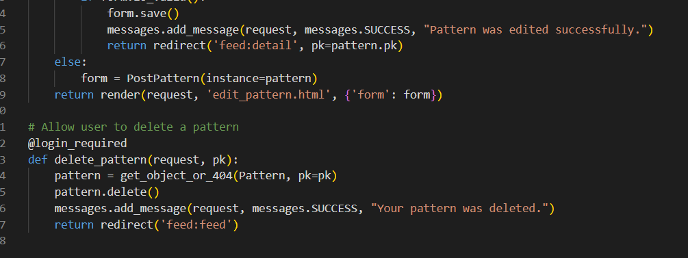
    

   
 - I added an @login_required to the edit and delete views to prevent users accessing them by editing the URL 

    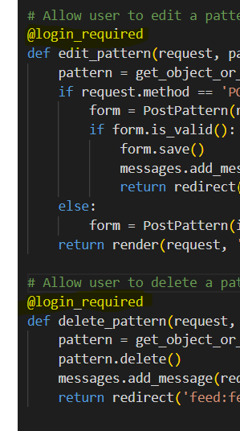
    

- Removed link in base.html that was causing HTML errors 

   
 - Added image validation for png and jpegs on profile pictures and pattern pictures  

    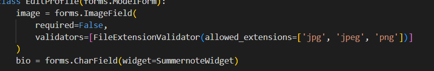
    

  
 - Found that summernote widget is causing Issues in console, potential fix could be to remove it altogether or find a different formatter   

  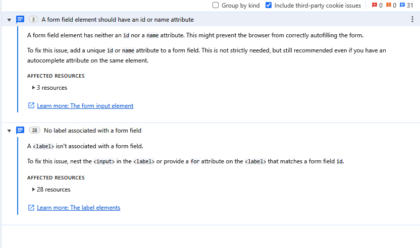
  

