# Generation Knit 

## Overview

Generation Knit is a pattern charing website, built to address the need for a modern, responsive and accesbile website in the online knitting space. It provides a space for users to upload and share pattterns for knitting and crochet 

[Screenshot of Generation Knit home page]

## Project Goals 

For my fourth portfolio projects, I wanted to create a project that both showcased my proficiency with databases, Bootstrap and Django. My project goal is to show that I can use these tools effectively in a creative way.

Generation Knit serves as a platform to both share and find knitting patterns. The goal was to create a platform that stores the information that comes with a knitting pattern and display it back to the user in an attractive and intuitive. The largest community based knitting website on the internet has long been criticized for its confusing layout and lack of accessibilty for visually impaired users. My website aims to address these issues.

## Contents: 

- What happened to Generation Knit 1.0? 
- UX Design
- Accessibilty Focus
- User Avatar
- Site Goals
- Agile Method
- Wireframes
- Data Modelling Relationships
- Structure
- - Features
- - Future Features
- Design 
- - Colours 
- - Typography 
- Languages 
- - Django 
- - JavaScript
- - Bootstrap
- Deployment
- Linting 
- Error Hall of Fame
- Citations 


## What happened to Generation Knit 1.0? 
## UX Design

I wanted a simple home page to let the images speak for themselves. Looking at the images is the most pleasurable part of browsing knitting patterns, it should no be marred by stray information all over the page.
## Accessibilty Focus
## User Avatar
## Site Goals
## Agile Method

### User Stories

For Agile development, user stories are an important part of the process. They allow developers to plan according to the needs of the user. This ensures that important steps for the user's experience aren't overlooked in developement. 

On my kanban board, user stories are marked as Must Have, Could Have, or Beautify. Beautify is for styling that doesn't affect functionality.

My user stories are as follows: 

- Users Story: Registration
- User Story: Homepage/Feed
- User Story: Pattern Detail Page
- User Story: User Profile
- User Story: Search for patterns
- User Story: Navigation Bar
- User Story: Upload a Pattern

This can be viewed in closer detail in the [issues section of this project](https://github.com/carlalennon/generation-knit-2.0/issues).


## Wireframes

### Early Wireframes to get the "Vibe"

  <details>
    <summary> Early wireframe for the hamburger menu</summary>
    
    </details>
    
  <details>
    <summary>Early wireframe for the home feed</summary>
    
    </details>

  <details>
    <summary> Early wireframe for login page</summary>
    
    </details>

  <details>
    <summary> Wireframe for a pattern generation tool</summary>
    
    </details>


### Search Wireframes
  <details>
    <summary> Large Wireframe</summary>
    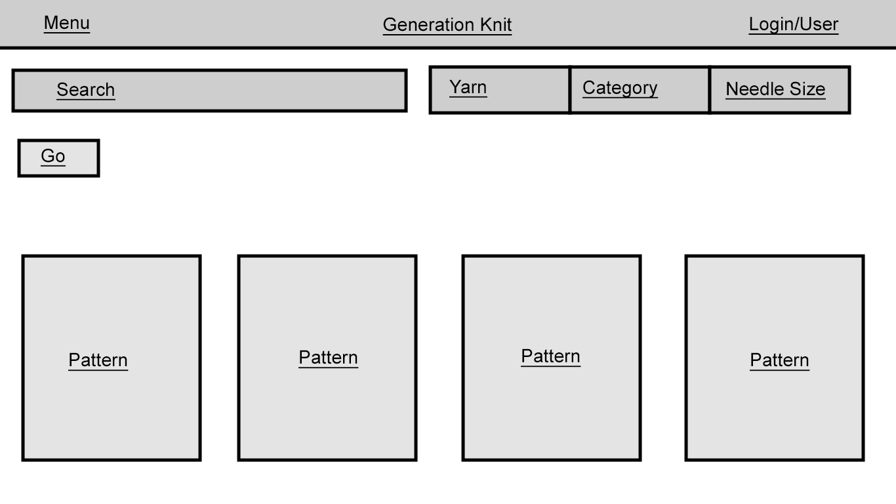
    </details>

  <details>
    <summary> Small Wireframe</summary>
    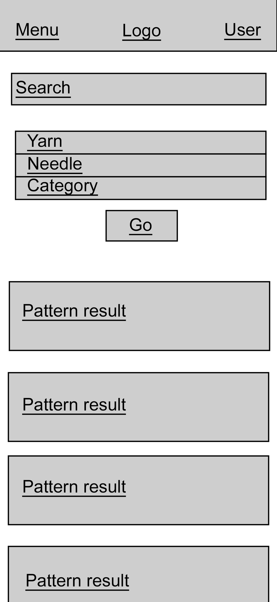
    </details>

  <details>
    <summary> Search result preview for large screen</summary>
    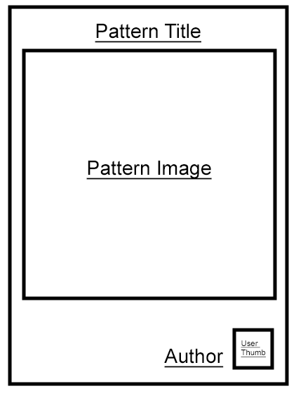
    </details>

  <details>
    <summary> Search result preview for small screen</summary>
    
    </details>
    
  ### Profile Wireframes

  <details>
    <summary> User Profile on large screen</summary>
    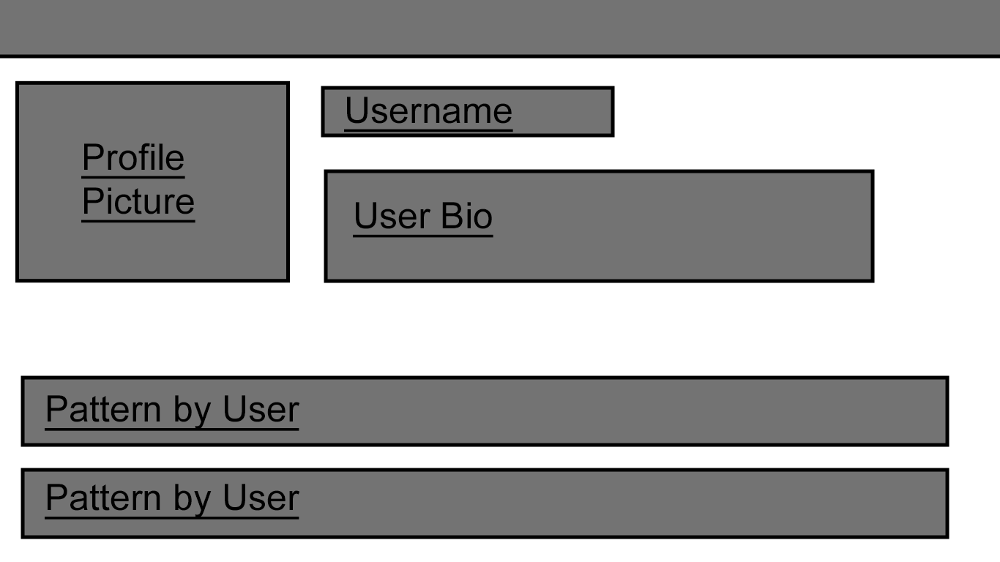
    </details>

  <details>
    <summary> User Profile on small screen</summary>
    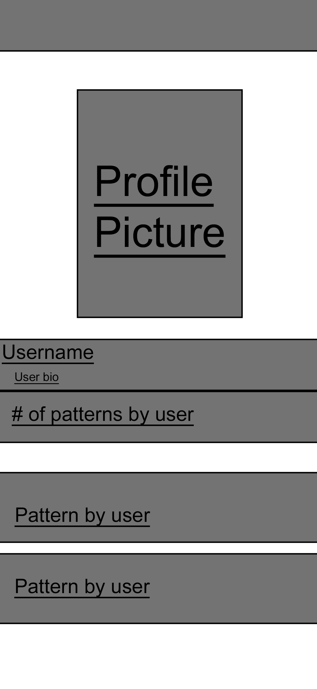
    </details>

### Feed Wireframes

  <details>
    <summary> Large Wireframe</summary>
    
    </details>

  <summary> Small Wireframe</summary>
    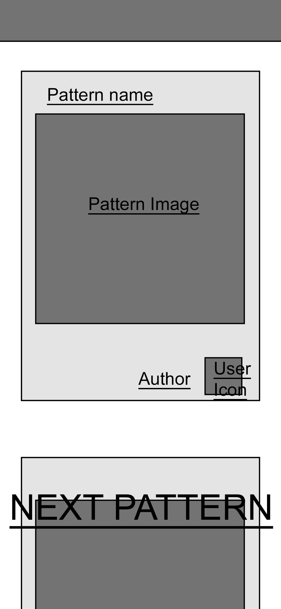
    </details>

## Data Modelling Relationships
## Structure
### Features
###  Future Features

- Add multiple image uploads to patterns
- Add Cloudinary upload widget to forms for ease of use for user
## Design 
### Colours 
Anything over 7 is very accesible 
My accessible colours:

#F9F4BA  18.68:1
#F6EE9A  17.61:1
#f0e332  15.74:1
#d9c626  12.06:1
#c2a91a  8.98:1


### Typography 
## Languages 
### Git 

I used git for version control on this project. Version control allows me to track and control changes to the project. It also allows me to restore older versions of the project should something go wrong. 

I tracked my project using git. I wrote a small descriptive note for each commit to github.

### Django 

I used Django to build my project. Django is a Python framework for developing web apps. Django comes with security features built in to keep sensitive data hidden. It is a popular framework and is widely used in professional development settings. 

I especially liked the tag system, as the tags can accept logical arguments. These can be used to determine whether to show certain HTML or iterate over database entries.


### JavaScript

I used Javascript in combination with Bootstrap to make my website neater and more responsive to the user. A javascript feature of note is the hambuger menu in which the navigation tags are hidden. This allows less visual clutter on the page for the user. It is especially effective for mobile users.

Javascript is not installed in this project, rather it is loaded in using a tag in base.html. The tag is based on the bottom of the page to improve loading times.


### Bootstrap

I used Bootstrap to design the HTML of my website. 

Bootstrap is a 

### CSS 


## Deployment
## Error Hall of Fame

  <summary> This duplicate id error appeared on pages when there were 2 different HTML sections for small and large screen. I've decided to ignore them as due to the way they styling is done, only one element appears on the screen at a time</summary>
    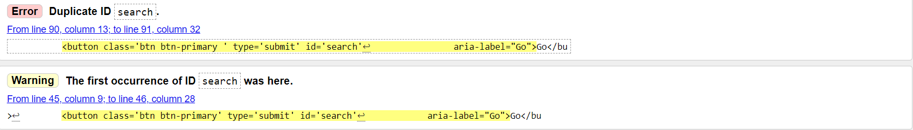
    </details>


## Linting 

### HTML

I used the W3C schools linter to check my html. It does not like Django tags, so my goal was to solve every error it gave apart from the Django related errors. 

The HTML linter really didn't like Django, and showed a lot of errors in all HTML with Django tags 
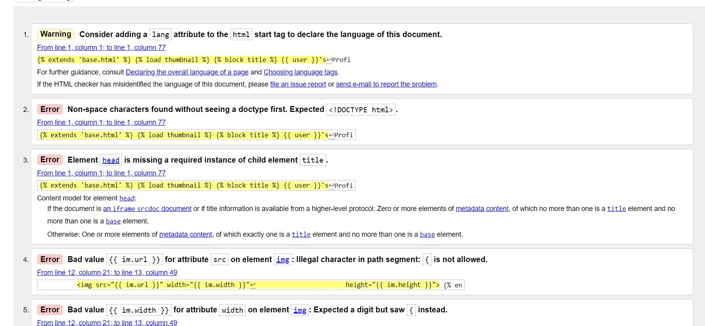

I used "Validate by Direct Input"

I worked through errors in my code until only the Django related errors were left. 

Some common errors:


  <summary> Button cannot be a child of an "a" tag</summary>
    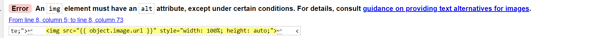
    </details>

  <summary> Image tags require an alt attribute (I had been using "name" as an alt )</summary>
    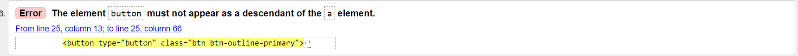
    </details>

  <summary> Stray tags </summary>
    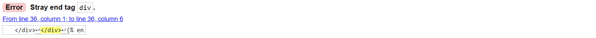
    </details>


## Known Errors 

- The summernote widget does not respond to screen size in the edit pattern and profile pages
- User cannot upload more than one image for a pattern 

## Citations 

### Porting User Stories over from old project 


Rewriting user stories over from old project

As a <role>
I can <capability>
So that <received benefit>

In order to <receive benefit>
as a <role>
I can <goal/desire>

Example:
"As a warehouse employee
I can choose the size of paper to print on 
To make a label that matches the size of a parcel"

"In order to check out multiple items
As a user
I can add multiple items to cart"

Each user story needs a card, conversation and a confirmation.

Card : The user story that fits on a post-it note, as the example above
Conversation : The discussion around the needs of the user story. In the above example, "What paper sizes should be included? What information should be included in the print-out?"
Confirmation : Confirm the understanding and acceptance criteria


Sources: 

Skillshare course
https://cloudinary.com/blog/managing-media-files-in-django

Allauth docs
https://docs.allauth.org/en/latest/

Using re_path since URLS is deprecated
https://docs.djangoproject.com/en/4.0/ref/urls/

Adding summernote to forms
https://ctrlzblog.com/how-to-add-a-text-editor-to-a-django-blog-with-summernote/

Bootstrapping a django form
https://ngangasn.com/how-to-use-bootstrap-5-with-django-the-right-way/

Creating the models
https://docs.djangoproject.com/en/5.0/topics/db/models/

Multiple file handling for pattern uploads
https://docs.djangoproject.com/en/5.0/topics/http/file-uploads/

More multiple file handling
https://qasimalbaqali.medium.com/upload-multiple-images-to-a-post-in-django-ff10f66e8f7as

Cloudinary upload widget
https://cloudinary.com/documentation/upload_widget

Classy class based views resource 
https://ccbv.co.uk/projects/Django/5.0/django.views.generic.edit/FormView/

Sorl thumbnail docs 
https://sorl-thumbnail.readthedocs.io/en/latest/

Deleting a post
https://tutorial-extensions.djangogirls.org/en/homework/

Adding messages to edit/delete post 
https://docs.djangoproject.com/en/5.0/ref/contrib/messages/

Create search function
https://learndjango.com/tutorials/django-search-tutorial

Classy Class Based Views
https://ccbv.co.uk/

Getting posts by user
https://docs.djangoproject.com/en/5.0/topics/db/queries/

Filtering a user's posts for their profile
https://medium.com/@abdelrahman.hassan.hamdy/leveraging-custom-filters-in-django-for-effective-data-rendering-b3efdb04ae64

Pagination help 
https://docs.djangoproject.com/en/5.0/topics/pagination/

File validation for pattern PDFs 
https://pypi.org/project/django-upload-validator/#:~:text=Django%20Upload%20Validator%20is%20a,extensions%20using%20python%2Dmagic%20library.

Cloudinary delivery PDF fail 
https://support.cloudinary.com/hc/en-us/articles/360016480179-PDF-or-ZIP-files-appearing-in-Media-Library-but-download-URLs-return-an-error

Making a field optional in the upload form
https://subscription.packtpub.com/book/web-development/9781787281141/5/ch05lvl1sec34/making-fields-optional

MIME types for documents
https://developer.mozilla.org/en-US/docs/Web/HTTP/Basics_of_HTTP/MIME_types/Common_types

Accessbile colour schemes
https://venngage.com/blog/accessible-colors/

Accessible colour palette generator 
https://venngage.com/tools/accessible-color-palette-generator

Bootstrap Overrides
https://blog.hubspot.com/website/how-to-override-bootstrap-css

Django widget tweaks 
https://github.com/jazzband/django-widget-tweaks


Welcome carlalennon lennon,

This is the Code Institute student template for Gitpod. We have preinstalled all of the tools you need to get started. It's perfectly ok to use this template as the basis for your project submissions.

You can safely delete this README.md file, or change it for your own project. Please do read it at least once, though! It contains some important information about Gitpod and the extensions we use. Some of this information has been updated since the video content was created. The last update to this file was: **September 1, 2021**

## Gitpod Reminders

To run a frontend (HTML, CSS, Javascript only) application in Gitpod, in the terminal, type:

`python3 -m http.server`

A blue button should appear to click: _Make Public_,

Another blue button should appear to click: _Open Browser_.

To run a backend Python file, type `python3 app.py`, if your Python file is named `app.py` of course.

A blue button should appear to click: _Make Public_,

Another blue button should appear to click: _Open Browser_.

In Gitpod you have superuser security privileges by default. Therefore you do not need to use the `sudo` (superuser do) command in the bash terminal in any of the lessons.

To log into the Heroku toolbelt CLI:

1. Log in to your Heroku account and go to *Account Settings* in the menu under your avatar.
2. Scroll down to the *API Key* and click *Reveal*
3. Copy the key
4. In Gitpod, from the terminal, run `heroku_config`
5. Paste in your API key when asked

You can now use the `heroku` CLI program - try running `heroku apps` to confirm it works. This API key is unique and private to you so do not share it. If you accidentally make it public then you can create a new one with _Regenerate API Key_.

------

## Release History

We continually tweak and adjust this template to help give you the best experience. Here is the version history:

**September 20 2023:** Update Python version to 3.9.17.

**September 1 2021:** Remove `PGHOSTADDR` environment variable.

**July 19 2021:** Remove `font_fix` script now that the terminal font issue is fixed.

**July 2 2021:** Remove extensions that are not available in Open VSX.

**June 30 2021:** Combined the P4 and P5 templates into one file, added the uptime script. See the FAQ at the end of this file.

**June 10 2021:** Added: `font_fix` script and alias to fix the Terminal font issue

**May 10 2021:** Added `heroku_config` script to allow Heroku API key to be stored as an environment variable.

**April 7 2021:** Upgraded the template for VS Code instead of Theia.

**October 21 2020:** Versions of the HTMLHint, Prettier, Bootstrap4 CDN and Auto Close extensions updated. The Python extension needs to stay the same version for now.

**October 08 2020:** Additional large Gitpod files (`core.mongo*` and `core.python*`) are now hidden in the Explorer, and have been added to the `.gitignore` by default.

**September 22 2020:** Gitpod occasionally creates large `core.Microsoft` files. These are now hidden in the Explorer. A `.gitignore` file has been created to make sure these files will not be committed, along with other common files.

**April 16 2020:** The template now automatically installs MySQL instead of relying on the Gitpod MySQL image. The message about a Python linter not being installed has been dealt with, and the set-up files are now hidden in the Gitpod file explorer.

**April 13 2020:** Added the _Prettier_ code beautifier extension instead of the code formatter built-in to Gitpod.

**February 2020:** The initialisation files now _do not_ auto-delete. They will remain in your project. You can safely ignore them. They just make sure that your workspace is configured correctly each time you open it. It will also prevent the Gitpod configuration popup from appearing.

**December 2019:** Added Eventyret's Bootstrap 4 extension. Type `!bscdn` in a HTML file to add the Bootstrap boilerplate. Check out the <a href="https://github.com/Eventyret/vscode-bcdn" target="_blank">README.md file at the official repo</a> for more options.

------

## FAQ about the uptime script

**Why have you added this script?**

It will help us to calculate how many running workspaces there are at any one time, which greatly helps us with cost and capacity planning. It will help us decide on the future direction of our cloud-based IDE strategy.

**How will this affect me?**

For everyday usage of Gitpod, it doesn’t have any effect at all. The script only captures the following data:

- An ID that is randomly generated each time the workspace is started.
- The current date and time
- The workspace status of “started” or “running”, which is sent every 5 minutes.

It is not possible for us or anyone else to trace the random ID back to an individual, and no personal data is being captured. It will not slow down the workspace or affect your work.

**So….?**

We want to tell you this so that we are being completely transparent about the data we collect and what we do with it.

**Can I opt out?**

Yes, you can. Since no personally identifiable information is being captured, we'd appreciate it if you let the script run; however if you are unhappy with the idea, simply run the following commands from the terminal window after creating the workspace, and this will remove the uptime script:

```
pkill uptime.sh
rm .vscode/uptime.sh
```

**Anything more?**

Yes! We'd strongly encourage you to look at the source code of the `uptime.sh` file so that you know what it's doing. As future software developers, it will be great practice to see how these shell scripts work.

---

Happy coding!
